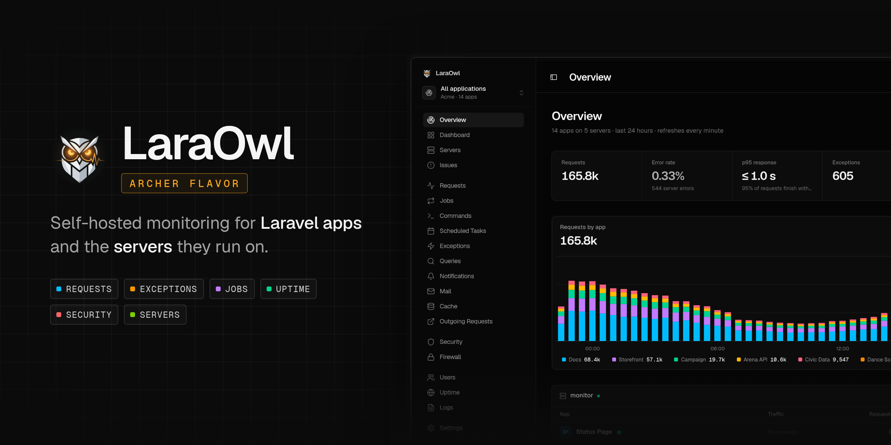
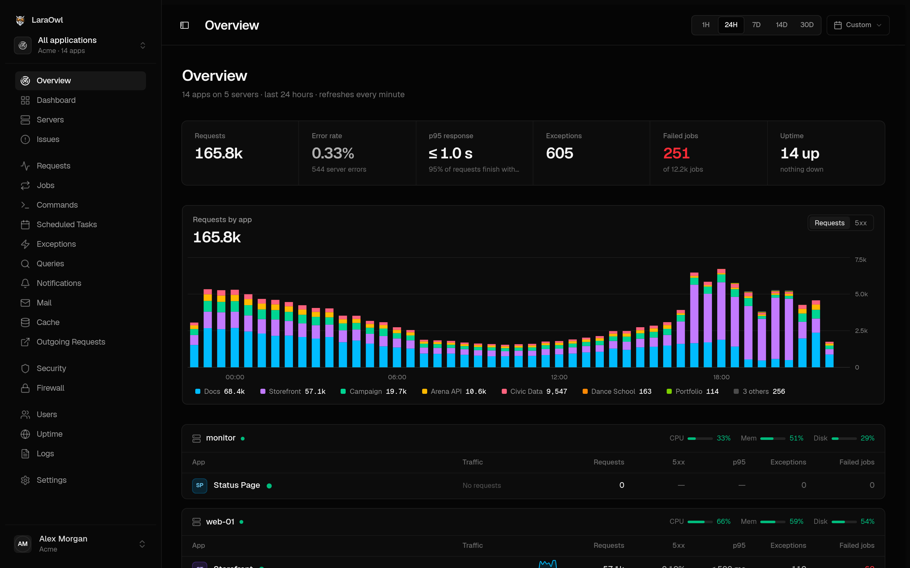
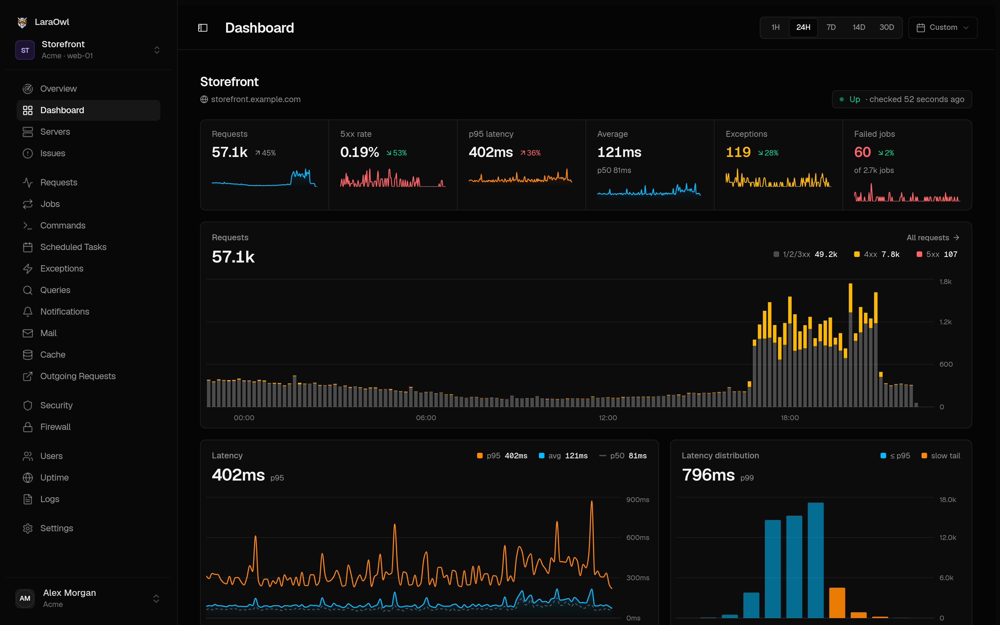
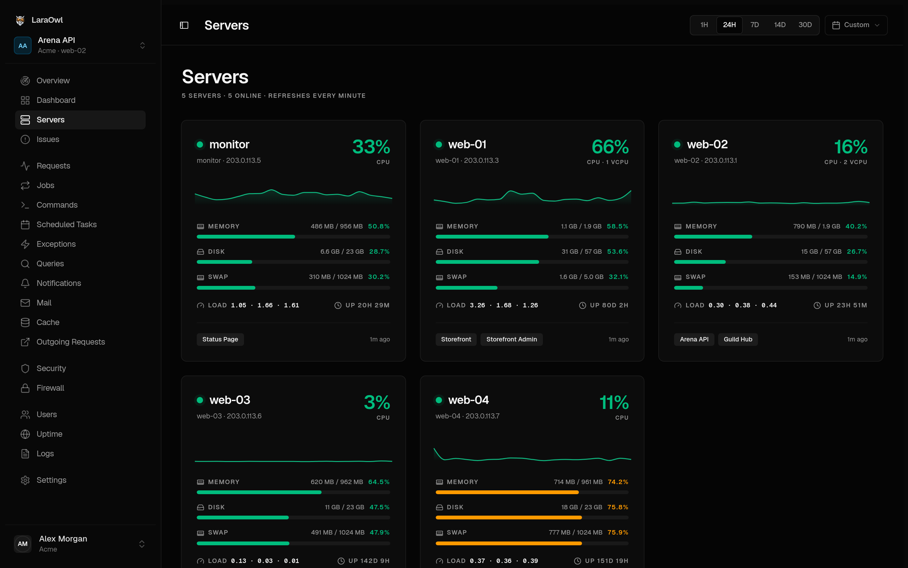
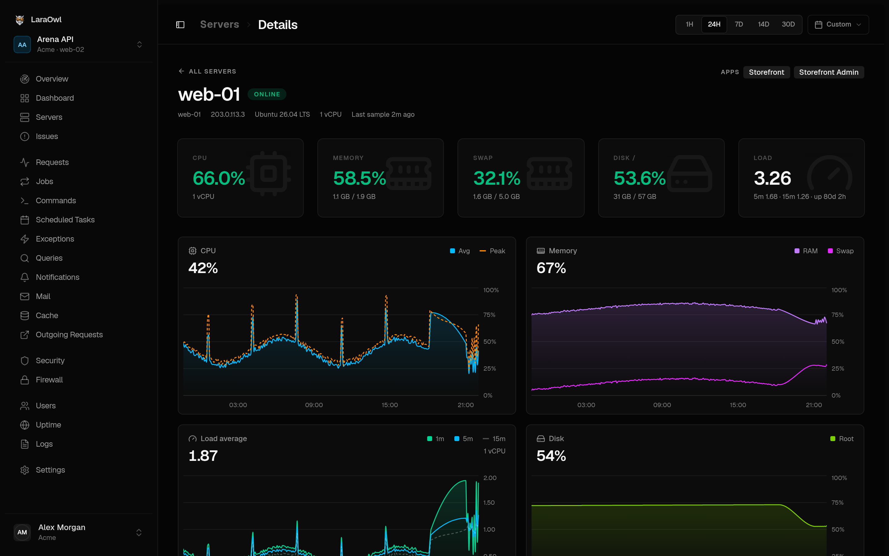

<p align="center">
  
</p>

<h1 align="center">LaraOwl · Archer flavor</h1>

<p align="center">
  <b>The Archer flavor of <a href="https://github.com/laraowl/laraowl">LaraOwl</a>: self-hosted monitoring for Laravel apps and the servers they run on.</b><br>
  Rebuilt to watch many apps on a few small servers: server metrics next to the apps, one overview for all of them,<br>
  ingest that holds up on 1 vCPU, security alerts that stay quiet until they matter, and a sharper interface.
</p>

<p align="center">
  <a href="#what-the-archer-flavor-changes">What the Archer flavor changes</a> •
  <a href="#what-it-watches">What it watches</a> •
  <a href="#install">Install</a> •
  <a href="#connect-an-app">Connect an app</a> •
  <a href="#monitor-a-server">Monitor a server</a> •
  <a href="#deploy-on-laravel-forge">Deploy on Forge</a> •
  <a href="#how-ingest-works">How ingest works</a> •
  <a href="#credits-and-license">Credits</a>
</p>

---

<p align="center">
  
</p>

<table>
  <tr>
    <td width="50%"></td>
    <td width="50%"></td>
  </tr>
  <tr>
    <td></td>
    <td valign="top">
      <b>Overview</b>: every app of a team on one page, grouped by server, with requests by app over time. Click a legend entry to switch an app off.<br><br>
      <b>App dashboard</b>: requests by outcome, latency with p50/p95/max per point, and its distribution.<br><br>
      <b>Servers</b>: CPU, memory, swap, disk and load from a one-file agent, next to the apps each machine runs.
    </td>
  </tr>
</table>

## What the Archer flavor changes

The Archer flavor started from LaraOwl on 3 October 2026 and runs in production for 14 apps on five servers. Everything below is new or reworked compared with the original.

### Servers next to the apps

- **Server monitoring.** A one-file bash agent reports CPU, memory, swap, every disk, load and uptime each minute. CPU is the average since the last run, not a one-second sample that catches the cron burst.
- **Servers pages.** An overview of every machine, and a detail page with CPU, memory, load and disk over time. Each server has its own token.
- **Apps know their server.** Apps are linked to the server their records come from, automatically. The app switcher groups apps by server, and each app's settings have a server picker.
- **One overview for the whole team.** Every app on a single page, grouped by server, with live server load. It shows requests by app over time, error rate, p95, exceptions and failed jobs. Signing in lands there.

### Ingest that holds up on a small box

- **Answers at once.** The endpoint checks a cached token, appends the batch to a Redis buffer and returns `202`.
- **Writes in bulk.** One queued job merges each app's batches into a single bulk write, with plain rows in one insert. In benchmarks on Postgres this was 5× faster, with 4.6× less PHP CPU and 5.8× fewer queries than storing each batch as it arrives.
- **Survives trouble.**
  - Backlog: if it grows, the endpoint returns `503` with `Retry-After`.
  - Database: if it goes away, batches wait and are retried in order.
  - Bad batch: one that fails on its own is set aside, and `laraowl:ingest:replay` puts it back in line.
  - `laraowl:ingest:status` shows the backlog.
- **Load-tested** on a 1 vCPU, 2 GB server: 2,000 batches at 40 per second, every one accepted and stored.
- **Accurate timestamps.** Every record keeps the moment it arrived, so charts stay right even when processing runs behind.
- **Raw detail only where it's useful.** Rollups count every record, so charts and totals stay exact. Raw query, cache and outgoing-call rows, most of what an app sends, are kept for the requests worth opening (slow, failed or with an exception) and for a fixed sample of the rest.
- **Indexed lookups.** Top users and server linking use indexes instead of scanning JSON or the whole records table.

### Security alerts that stay quiet until they matter

- **One issue per IP address.** It escalates as the score rises, and reopens if the address comes back after being resolved. Ignored stays ignored.
- **Quiet issues resolve themselves.** An address that has sent nothing suspicious for a day is resolved, with a note saying why.
- **Stale pages aren't scans.** Missing scripts, styles and images from a stale page don't count as a directory scan.
- **No false matches on your own URLs or headers.** An app's own URLs, and headers like a link-preview bot's user agent, are no longer read as remote file includes.
- **Audits start from a baseline.** The first file audit records the baseline instead of raising an alarm.
- **Scanner detection works.** Scanner user agents (sqlmap, nikto and others) are actually detected; the check never ran before.

### A sharper interface

- **New look.** A full redesign: Geist and Geist Mono, a tight corner scale, a compact sidebar and calmer type.
- **One chart kit everywhere.**
  - A shared crosshair, a finer grid, and time ticks in local time.
  - p50/p95/max per point, and a latency histogram with the slow tail marked.
  - Server charts match app charts.
- **Legends switch series on and off.** Click to hide, alt-click to show only one; the headline and totals follow.
- **Periods and dates.** The period selector slides and prefetches the next period. Custom ranges use a two-month calendar with presets. Dates read dd/mm/yyyy.
- **Motion with restraint.** Panels and charts animate in, figures slide when they change, and pages dim while loading. All of it respects reduced-motion settings.

### Operations

- **Deploys on Laravel Forge that stay light.** [`deploy.sh`](deploy.sh) makes Forge's Deploy button do everything on the server. It reuses the last frontend build and `vendor/` when nothing they depend on changed, so most deploys take about 16 seconds. Everything runs under `nice`, and it reloads PHP-FPM so each release starts with a clean code cache. From a laptop, `./deploy.sh` tests, pushes, deploys and checks in one command.
- **Uptime checks identify themselves as a bot**, so monitored apps don't count them as visitors.
- **Uptime response times are each site's own.** The checks run side by side, and each result used to be timed from the start of the batch, so every site showed the slowest one's time.
- **Plain PHP sites too.** [LaraOwl Lite](https://github.com/danielarcher/laraowl-lite) brings requests, errors and warnings from sites without Laravel, at a few KB per request.
- **Updates come from this repository**, not the original project's releases, which would overwrite these changes.

## What it watches

Add one Composer package to a Laravel app and LaraOwl records what it does:

| | |
|---|---|
| **Requests** | Method, route, status, duration and user, with p50/p95/p99 and a latency histogram |
| **Exceptions** | Grouped into issues with stack traces, occurrences, first and last seen, and status |
| **Queries** | Slow queries and N+1 patterns, per query and per request trace |
| **Jobs, commands, scheduled tasks** | Runs, durations, failures and retries |
| **Cache, mail, notifications, outgoing HTTP** | Hits and misses, what was sent, which external calls were made and how fast |
| **Logs** | Application logs, searchable |
| **Users** | Authenticated and guest traffic, per-user activity |
| **Uptime and heartbeats** | URL checks (every minute by default), and check-ins from cron jobs that go quiet |
| **Security** | SQL injection, XSS, path traversal, command injection and file inclusion in requests, scored per IP address; environment audits and file-integrity checks |
| **Servers** | CPU, memory, swap, disk and load from every machine, linked to the apps it runs |

Alerts go to Slack, Discord, Telegram, email or any webhook, for new exceptions, error spikes, slow routes, downtime and missed heartbeats. Several teams can share one instance, each with its own apps, servers and members. AI agents can query it over MCP.

## Install

Requirements: PHP 8.3+, Composer, Node 20+, Redis (for the ingest buffer) and a database. Postgres is what the Archer flavor runs in production; SQLite works for trying it out.

```bash
git clone https://github.com/danielarcher/laraowl.git
cd laraowl
composer install
npm ci && npm run build

cp .env.example .env
php artisan key:generate
php artisan migrate
```

Set `ALLOW_REGISTRATION=true`, sign up at `/register` (you get a personal team), then set it back to `false`. More teams: `php artisan laraowl:teams:create "Acme" you@example.com`.

Three processes keep it running:

```bash
php artisan queue:work          # stores incoming batches (required)
php artisan schedule:work       # uptime checks, retries, pruning, security clean-up (required; use cron in production)
php artisan reverb:start        # live updates in the browser (optional; BROADCAST_CONNECTION=log turns them off)
```

Check the ingest buffer at any time with `php artisan laraowl:ingest:status`.

<details>
<summary>Docker</summary>

The Docker setup comes from the original project: `docker-compose.yaml` runs the app, Horizon, Reverb, Caddy, the database and Redis. Copy `.env.prod` to `.env`, set `APP_URL`, `APP_HOSTNAME` and the `REVERB_*` keys, then run `docker compose up -d --build`. The Archer flavor is developed and run on Laravel Forge, so that is the path covered below.

</details>

## Connect an app

Create a project for the app; it gets the default alert rules and an API token:

```bash
php artisan laraowl:projects:create acme "Storefront" --url=https://storefront.example.com
```

Then, in the app:

```bash
composer require laraowl/client
```

```dotenv
LARAOWL_ENABLED=true
LARAOWL_SERVER_URL=https://laraowl.example.com
LARAOWL_TOKEN=the-project-token
```

`laraowl/client` 1.0.x requires Guzzle 7. Keep the client disabled in your test suite (`LARAOWL_ENABLED=false` in `phpunit.xml`).

### Plain PHP sites

Sites without Laravel use [LaraOwl Lite](https://github.com/danielarcher/laraowl-lite), a dependency-free client of four small classes (MIT). It sends requests, exceptions, fatal errors, warnings and logs in the same record format, after the page has been delivered, for about 15 µs and 3 KB per request:

```bash
composer config repositories.laraowl-lite vcs https://github.com/danielarcher/laraowl-lite
composer require danielarcher/laraowl-lite
```

```php
\LaraOwlLite\LaraOwlLite::start();   // first thing every page loads; reads the same LARAOWL_* settings
```

## Monitor a server

```bash
php artisan laraowl:servers:create acme web-01
```

This prints the commands to install the agent on that machine: a single bash script and a token file in `~/.laraowl`, run every minute from cron or a Forge scheduled job. Apps are linked to the server their records come from every ten minutes, and you can set the server by hand in an app's settings.

## Deploy on Laravel Forge

On a zero-downtime Forge site, the whole deployment script is:

```bash
$CREATE_RELEASE()
cd $FORGE_RELEASE_DIRECTORY
FORGE_PHP="$FORGE_PHP" FORGE_COMPOSER="$FORGE_COMPOSER" bash deploy.sh release
$ACTIVATE_RELEASE()
FORGE_PHP="$FORGE_PHP" FORGE_PHP_FPM="$FORGE_PHP_FPM" bash deploy.sh activated
$RESTART_QUEUES()
```

What `deploy.sh` does:

- **Release:** it installs PHP dependencies only when `composer.lock` changed, and otherwise copies the live `vendor/`. The frontend is rebuilt only when something it's made from changed: scripts, styles, views, Node config or `VITE_` settings. Otherwise it reuses one of the last five builds, and `node_modules` is cached per `package-lock.json`. Everything runs under `nice`, so the live site keeps the CPU.
- **Activated:** it reloads PHP-FPM, so the new release starts with an empty opcache, then restarts the queue.
- **From your laptop**, `./deploy.sh` runs the tests, pushes, starts the deployment through the Forge API, waits for it and checks the instance. Its settings go in `deploy.env`; see [`deploy.env.example`](deploy.env.example).

## How ingest works

```
app ──POST /api/records──▶ token check (cached) ──▶ Redis buffer ──▶ 202
                                                       │
                              queue worker ◀── one drain job at a time
                                   │
                    batches merged per app, written in bulk
                    ├─ rollups: every record, per minute
                    ├─ raw rows: the traces worth opening
                    └─ issues, security analysis, alerts
```

The scheduler queues a drain every minute in case a worker died mid-job. Batches that failed on their own are set aside in Redis; `php artisan laraowl:ingest:replay` puts them back in line.

## Credits and license

LaraOwl was created by Abdelmjid Saber and the contributors to [laraowl/laraowl](https://github.com/laraowl/laraowl). Its documentation at [laraowl.mintlify.site](https://laraowl.mintlify.site) covers the parts the Archer flavor shares with it.

The Archer flavor is maintained by [Daniel Archer](https://github.com/danielarcher). It is licensed under the [Apache License 2.0](LICENSE), like the original. [NOTICE](NOTICE) records the attribution, and the git history records every change.
